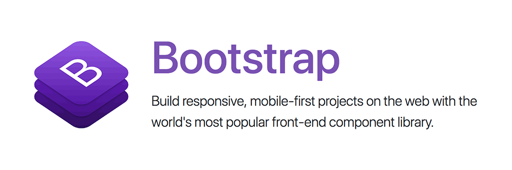

======================
django CMS Bootstrap 4
======================

|pypi| |build| |coverage|

**django CMS Bootstrap 4** is a plugin bundle for django CMS providing several
components from the popular `Bootstrap 4 <http://getbootstrap.com/>`_ library.

This addon is compatible with `Divio Cloud <http://divio.com>`_ and is also available on the
`django CMS Marketplace <https://marketplace.django-cms.org/en/addons/browse/djangocms-bootstrap4/>`_
for easy installation.

Contributing
============

This is a an open-source project. We'll be delighted to receive your
feedback in the form of issues and pull requests. Before submitting your
pull request, please review our `contribution guidelines
<http://docs.django-cms.org/en/latest/contributing/index.html>`_.

One of the easiest contributions you can make is helping to translate this addon on
`Transifex <https://www.transifex.com/projects/p/djangocms-bootstrap4/>`_.

Documentation
=============

See ``REQUIREMENTS`` in the `setup.py <https://github.com/divio/djangocms-bootstrap4/blob/master/setup.py>`_
file for additional dependencies:

* Python 2.7, 3.3 or higher
* Django 1.8 or higher
* Django Filer 1.2.4 or higher
* Django Text CKEditor 3.1.0 or higher
* Django CMS Icon 1.0.0 or higher
* Django CMS Link 2.1.0 or higher
* Django CMS Picture 2.0.6 or higher

Make sure `django Filer <http://django-filer.readthedocs.io/en/latest/installation.html>`_
and `django CMS Text CKEditor <https://github.com/divio/djangocms-text-ckeditor>`_
are installed and configured appropriately.

Installation
------------

For a manual install:

* run ``pip install djangocms-bootstrap4``
* add the following entries to your ``INSTALLED_APPS``::

    'djangocms_icon',
    'djangocms_link',
    'djangocms_picture',
    'djangocms_bootstrap4',
    'djangocms_bootstrap4.contrib.bootstrap4_alerts',
    'djangocms_bootstrap4.contrib.bootstrap4_badge',
    'djangocms_bootstrap4.contrib.bootstrap4_card',
    'djangocms_bootstrap4.contrib.bootstrap4_carousel',
    'djangocms_bootstrap4.contrib.bootstrap4_collapse',
    'djangocms_bootstrap4.contrib.bootstrap4_content',
    'djangocms_bootstrap4.contrib.bootstrap4_grid',
    'djangocms_bootstrap4.contrib.bootstrap4_jumbotron',
    'djangocms_bootstrap4.contrib.bootstrap4_link',
    'djangocms_bootstrap4.contrib.bootstrap4_listgroup',
    'djangocms_bootstrap4.contrib.bootstrap4_media',
    'djangocms_bootstrap4.contrib.bootstrap4_picture',
    'djangocms_bootstrap4.contrib.bootstrap4_tabs',
    'djangocms_bootstrap4.contrib.bootstrap4_utilities',

* run ``python manage.py migrate djangocms_bootstrap4``

Configuration
-------------

django CMS Bootstrap 4 **utilises** the following django CMS plugins:

* **django CMS Link**: `Link / Button <https://github.com/divio/djangocms-link/>`_
* **django CMS Picture**: `Picture / Image <https://github.com/divio/djangocms-picture/>`_
* **django CMS Icon**: `Icon <https://github.com/divio/djangocms-icon>`_

It provides the following **standard** Bootstrap 4 components:

* `Alerts <https://getbootstrap.com/docs/4.0/components/alerts/>`_
* `Badge <https://getbootstrap.com/docs/4.0/components/badge/>`_
* `Card <https://getbootstrap.com/docs/4.0/components/card/>`_
* `Carousel <https://getbootstrap.com/docs/4.0/components/carousel/>`_
* `Collapse <https://getbootstrap.com/docs/4.0/components/collapse/>`_
* `Content (Blockquote, Code, Figure) <https://getbootstrap.com/docs/4.0/content/>`_
* `Grid (Container, Row, Column) <https://getbootstrap.com/docs/4.0/layout/grid/>`_
* `Jumbotron <https://getbootstrap.com/docs/4.0/components/jumbotron/>`_
* `Link / Button <https://getbootstrap.com/docs/4.0/components/buttons/>`_
* `List group <https://getbootstrap.com/docs/4.0/components/list-group/>`_
* `Media <https://getbootstrap.com/docs/4.0/layout/media-object/>`_
* `Picture / Image <https://getbootstrap.com/docs/4.0/content/images/>`_
* `Tabs <https://getbootstrap.com/docs/4.0/components/navs/#tabs>`_
* `Utilities (Spacing) <https://getbootstrap.com/docs/4.0/utilities/>`_

Settings
~~~~~~~~

There are various settings possible on django CMS Bootstrap 4, to restrict them
for now only the following can be changed::

    DJANGOCMS_BOOTSTRAP4_TAG_CHOICES = ['div', 'section', 'article', 'header', 'footer', 'aside']

    DJANGOCMS_BOOTSTRAP4_CAROUSEL_TEMPLATES = (
        ('default', _('Default')),
    )

    DJANGOCMS_BOOTSTRAP4_GRID_SIZE = 12
    DJANGOCMS_BOOTSTRAP4_GRID_CONTAINERS = (
        ('container', _('Container')),
        ('container-fluid', _('Fluid container')),
    )
    DJANGOCMS_BOOTSTRAP4_GRID_COLUMN_CHOICES = (
        ('col', _('Column')),
        ('w-100', _('Break')),
        ('', _('Empty'))
    )

    DJANGOCMS_BOOTSTRAP4_USE_ICONS = True

    DJANGOCMS_BOOTSTRAP4_TAB_TEMPLATES = (
        ('default', _('Default')),
    )

    DJANGOCMS_BOOTSTRAP4_SPACER_SIZES = (
        ('0', '* 0'),
        ('1', '* .25'),
        ('2', '* .5'),
        ('3', '* 1'),
        ('4', '* 1.5'),
        ('5', '* 3'),
    )

Please see their code references for more details.

Running Tests
-------------

You can run tests by executing::

    virtualenv env
    source env/bin/activate
    pip install -r tests/requirements.txt
    python setup.py test

.. |pypi| image:: https://badge.fury.io/py/djangocms-bootstrap4.svg
    :target: http://badge.fury.io/py/djangocms-bootstrap4
.. |build| image:: https://travis-ci.org/divio/djangocms-bootstrap4.svg?branch=master
    :target: https://travis-ci.org/divio/djangocms-bootstrap4
.. |coverage| image:: https://codecov.io/gh/divio/djangocms-bootstrap4/branch/master/graph/badge.svg
    :target: https://codecov.io/gh/divio/djangocms-bootstrap4
